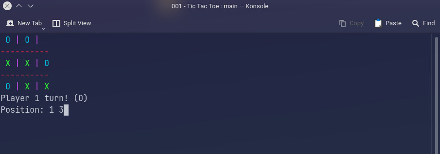

# tic-tac-toe
<b>Just a simple Tic Tac Toe game made in C programming languague</b>

It is not 100% finished and may have some bugs, i don't think that i'm going to finish this because i dont give a shit. My code is kinda shitty btw.

## If you, for some reason, want to test this

Type the line and column that you want to insert your symbol, in order. 

Example: 1 2 (Line 1, Column 2)

You can insert them separately, but why would you do that?
